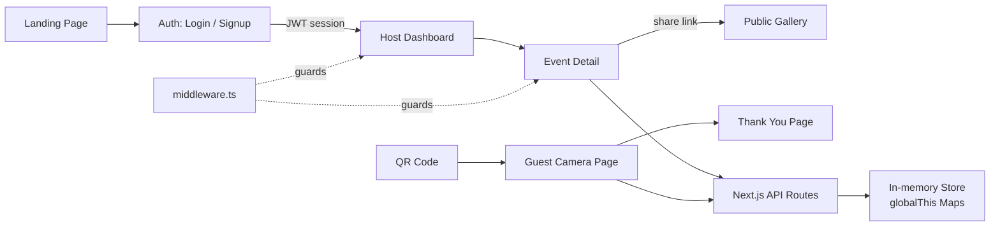

# Digital Disposable Camera Event App – PRD (Updated)

## 1. Product Summary

A web-based **digital disposable camera** platform for events. Hosts create private events and share a QR code or link. Guests scan the code, open a **browser-based camera**, and take a **limited number of photos** without installing an app or creating an account. Photos upload to a centralized gallery the host can view, moderate, and download.

Working name: **"Digital Disposable Events"**

**Current status**: Full MVP feature-complete with auth, moderation, gallery, PWA support.

## 2. Goals

### 2.1 MVP Goals (Implemented)

- [x] Simple event setup for hosts (minimal fields, intuitive flow)
- [x] Frictionless guest capture: scan → open camera → shoot → auto-upload
- [x] No guest login or app install required
- [x] Hard per-guest photo limit enforced in camera UI
- [x] Centralized event gallery with view, sort, download, and moderation
- [x] Cross-platform web support (iOS Safari, Android Chrome, desktop)
- [x] Host authentication (email/password + Google OAuth)
- [x] Per-event public gallery page (shareable link)
- [x] PWA manifest + service worker for installability
- [x] Camera filters (B&W, Vintage, Film, Retro)
- [x] Flash/torch toggle + front/back camera flip
- [x] Image compression before upload (max 1920px, JPEG 0.82)
- [x] Upload retry with exponential backoff (3 attempts)
- [x] Camera permission denial handling with browser-specific instructions
- [x] QR code generation + downloadable QR poster
- [x] Gallery ZIP download + slideshow mode
- [x] Photo moderation (Approve / Reject per photo + bulk actions)
- [x] Event editing (inline panel on event detail page)
- [x] Cover image upload (client-side resize + base64)

### 2.2 Non-Goals (MVP)

- Full-fledged account management UI (email verification, password reset)
- Real cloud storage (S3/CDN) — using base64 dataUrls in MVP
- Relational database — using in-memory Maps (resets on server restart)
- Advanced analytics or reporting
- AI enhancements, print integration, video capture, white-labeling

## 3. User Personas

### 3.1 Host (Event Organizer)

- Registers and logs in (email/password or Google OAuth)
- Creates and manages events with cover image, description, time, photo limits
- Shares event QR code or link with guests
- Monitors and moderates the photo gallery
- Downloads all photos as a ZIP

### 3.2 Guest

- Scans QR code or taps shared link
- Lands directly in event context without login
- Grants camera permission, uses in-browser camera with live filters
- Takes up to the configured photo limit per guest
- Photos auto-upload to event gallery; receives thank-you screen at limit

## 4. High-Level User Flows

### 4.1 Host Flow

1. Visit landing page → Sign up / Sign in
2. Authenticated dashboard → Create event (name, date, times, description, cover image, photo limit, moderation toggle)
3. Event detail page:
   - View/copy guest link and gallery link
   - Download QR image or poster
   - Edit event fields inline
   - Monitor gallery (auto-polls every 5s)
   - Approve/reject photos individually or in bulk (when moderation enabled)
   - Download all photos as ZIP
   - Launch full-screen slideshow

### 4.2 Guest Flow

1. Scan QR / open link → Event landing with cover image and description
2. Tap **"Open Camera"** → browser prompts for permission
   - On denial: shows instructional card with browser-specific steps + "Try again" button
3. Live camera preview with filter dropdown (bottom-left), flip (left), shutter (center), flash (right)
4. Capture → preview (Accept / Retake)
5. Accept → compressed upload with retry backoff → remaining count decrements
6. At limit → thank-you modal → dedicated thank-you page

### 4.3 Moderation Flow

- **Moderation ON**: uploads are `pending`; host sees "Pending" tab with Approve/Reject per photo plus "Approve all" / "Reject all" bulk actions; only approved photos appear in "All" tab and public gallery
- **Moderation OFF**: all uploads go directly to `approved` and appear immediately

## 5. Core Features (Current Implementation)

### 5.1 Authentication

- Email + password (bcrypt-hashed) via NextAuth.js Credentials provider
- Google OAuth via NextAuth.js Google provider
- Session-based auth with JWT tokens
- Middleware protects all `/dashboard/**` routes
- Events are scoped to `hostId` — hosts only see their own events

### 5.2 Event Management

- Create event: name (required), date (required), description, cover image (file upload, resized to max 1200px), per-guest photo limit (1–50), start/end time, moderation toggle
- Edit event: inline slide-in panel with same fields (except cover image)
- Event list on dashboard shows thumbnail, name, date, moderation status

### 5.3 Guest Camera Interface

- Landing: event name, date, times, cover image, description, photo count
- Camera UI: live preview with CSS filter overlay, filter dropdown, flip button, shutter, flash (if torch supported)
- Image capture: resized to max 1920px long edge, JPEG at 0.82 quality (~300–600 KB)
- Preview: Accept / Retake; upload with 3-attempt exponential backoff
- Permission denied: friendly error card with iOS Safari / Android Chrome / Desktop Chrome instructions
- Photo limit: thank-you modal → `/e/{id}/thanks` page

### 5.4 Photo Storage (MVP)

- Photos stored as JPEG base64 dataUrls in in-memory Map on server
- Metadata: eventId, guestSessionId, status, createdAt
- **Next step**: migrate to S3 + CDN-backed URLs

### 5.5 Event Gallery (Host)

- Grid view of all approved photos (or all photos if moderation off)
- Pending view: thumbnail grid with per-photo Approve/Reject + "Approve all"/"Reject all" bulk actions
- Rejected photos are deleted
- ZIP download of all visible photos
- Full-screen slideshow with keyboard navigation + auto-advance (4s)

### 5.6 Public Gallery

- Route `/gallery/{eventId}` — public, no-auth required
- Shows approved photos (or all if moderation off) in a masonry-style grid
- Full-screen slideshow mode
- Linked from host event detail page with a copyable URL

### 5.7 QR Code & Poster

- In-browser QR code generation (via `qrcode` library) rendered to canvas
- Download QR as PNG
- Download QR poster: event name + date + QR + instruction text, composited to canvas

### 5.8 PWA

- `public/manifest.json`: name, short_name, theme, background color, display standalone
- `public/sw.js`: network-first for navigation, cache-first for static assets, pass-through for API calls
- Service worker registered on mount via `ServiceWorkerRegistrar` component

### 5.9 Image Handling Pipeline (Updated)

Reworked to capture and preserve high-quality, print-worthy photos instead of low-resolution video frames.

**Capture**
- Guest capture uses the **native device camera** via `<input type="file" accept="image/*" capture="environment">`, which returns a **full-resolution still (12MP+)**. The previous live `getUserMedia` viewfinder, in-app filters, flip, and torch controls were removed (the OS camera provides its own).
- On iPhone, HEIC is converted to JPEG client-side (`heic2any`).
- The original is capped **client-side** to ~4000px long edge (~12MP) at JPEG q92 before upload — keeps files lean for weak event Wi-Fi while staying print-worthy.

**Three stored versions per photo** (S3 keys share one UUID):
| Tier | Key prefix | Size / quality | Used for |
|---|---|---|---|
| Original | `photos/originals/` | ~12MP, untouched (q92) | Host ZIP download |
| Display | `photos/display/` | ≤2048px, q85 | Public gallery + slideshow |
| Thumbnail | `photos/thumb/` | ≤400px, q70 | Gallery grids |

**Upload flow (presigned direct-to-S3)**
1. `POST /api/events/[id]/photos/presign` — re-checks time window + per-guest limit, returns a short-lived presigned PUT URL + key.
2. Browser `PUT`s the original directly to S3 (bypasses the app server).
3. `POST /api/events/[id]/photos` (finalize) — re-validates, reads the original from S3, generates display + thumbnail with `sharp` (`.rotate()` auto-orients from EXIF), stores all three URLs on the `Photo` row.

The per-guest count is unchanged: one photo = one `Photo` row (three S3 objects), the limit is checked at both presign and finalize, and the count is `Photo` row count. A failed finalize leaves an orphan original in S3 (does not count against the guest) — candidate for a future cleanup job.

**Data model change:** `Photo` gains `originalUrl` and `thumbnailUrl` (nullable; `storageUrl` now holds the display version). Legacy rows were backfilled so all three point at the original single object.

**Infrastructure requirements (production):**
- **S3 bucket CORS** must allow `PUT` from the app origin (and `http://localhost:3000` for dev), or browser presigned uploads are blocked.
- **IAM** behind the S3 credentials must allow `s3:GetObject` (new — finalize reads the original back), in addition to the existing `s3:PutObject` / `s3:DeleteObject`.
- Amplify SSR/function memory ≥512MB–1GB recommended (server-side `sharp` decode of a 12MP image).

**Open decision:** originals are currently downloadable from both the host page and the public gallery — see todo `decide-original-download-access`.

## 6. Technical Stack

| Layer | Technology |
|---|---|
| Framework | Next.js (App Router) |
| Language | TypeScript |
| Styling | Tailwind CSS v4 |
| Auth | NextAuth.js v5 (beta) |
| Password hashing | bcryptjs |
| QR code | qrcode |
| ZIP | jszip |
| Storage (MVP) | In-memory Map on `globalThis` |
| Camera API | `navigator.mediaDevices.getUserMedia` |
| Image processing | HTML Canvas API |

## 7. Data Model

### 7.1 Event

```ts
{
  id: string;
  slug: string;
  hostId: string;        // scopes to authenticated host
  name: string;
  date: string;
  description?: string;
  coverImageUrl?: string; // base64 dataUrl (MVP) → S3 URL (production)
  photoLimitPerGuest: number;
  startTime?: string;
  endTime?: string;
  moderationEnabled: boolean;
  createdAt: string;
  updatedAt: string;
}
```

### 7.2 Photo

```ts
{
  id: string;
  eventId: string;
  guestSessionId: string;  // localStorage per event per browser
  dataUrl: string;          // base64 JPEG (MVP) → S3 URL (production)
  status: "pending" | "approved" | "rejected";
  createdAt: string;
}
```

### 7.3 User

```ts
{
  id: string;
  email: string;
  name: string;
  passwordHash?: string;    // undefined for OAuth users
  provider: "credentials" | "google";
  createdAt: string;
}
```

## 8. Environment Variables

```env
AUTH_SECRET=<32-byte random string>   # required — NextAuth signing secret
AUTH_GOOGLE_ID=<your-google-client-id>
AUTH_GOOGLE_SECRET=<your-google-client-secret>
```

## 9. Pending / Production Readiness Items

1. **Real database**: replace `lib/store.ts` in-memory Maps with PostgreSQL via Prisma or Drizzle
2. **S3 photo storage**: upload images to S3/R2 on server; store CDN URLs instead of base64
3. **PWA icons**: generate actual 192×192 and 512×512 PNG app icons for the manifest
4. **Google OAuth credentials**: configure real client ID/secret in production `.env`
5. **Email verification + password reset**: add these auth flows for credentials users
6. **Rate limiting**: protect photo upload endpoint (e.g. 1 req/s per guest session)
7. **CDN caching**: serve photos via CloudFront or Cloudflare in front of S3
8. **Event archival**: soft-delete events + photos, preserve storage longer than server restarts

## 10. Out-of-Scope / Phase 3 Items

These are **not** part of the current implementation but the architecture supports them:

- AI enhancements and auto-fix for photos
- Face grouping and guest tagging
- Live event screen display (real-time WebSocket slideshow)
- Instant print integration
- Photo book ordering
- Advanced analytics dashboard (engagement stats, per-guest activity)
- Multi-language support
- Video capture mode
- White-labeling and B2B integrations
- Custom branded camera themes beyond current filters

## 11. Architecture Diagram


