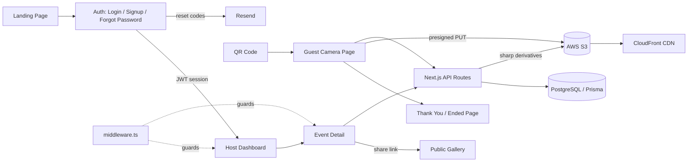

# Digital Disposable Camera Event App – PRD (Updated)

## 1. Product Summary

A web-based **digital disposable camera** platform for events. Hosts create private events and share a QR code or link. Guests scan the code, capture a **limited number of photos** with their phone's **native camera** (no app install, no account), and the photos upload to a centralized gallery the host can view, moderate, and download.

Working name: **"Digital Disposable Events"**

**Current status**: Production architecture — PostgreSQL (Neon) + Prisma, AWS S3 + CloudFront storage with a three-tier image pipeline, native-camera capture, event time windows, host auth incl. password reset, moderation, galleries, and PWA support. Deployed on AWS Amplify.

## 2. Goals

### 2.1 MVP Goals (Implemented)

- [x] Simple event setup for hosts (minimal fields, intuitive flow)
- [x] Frictionless guest capture: scan → open camera → shoot → auto-upload
- [x] No guest login or app install required
- [x] Hard per-guest photo limit enforced in camera UI
- [x] Centralized event gallery with view, sort, download, and moderation
- [x] Cross-platform web support (iOS Safari, Android Chrome, desktop)
- [x] Host authentication (email/password + Google OAuth)
- [x] Per-event public gallery page (shareable link)
- [x] PWA manifest + service worker for installability
- [x] **Native-camera capture** of full-resolution (12MP) stills (replaced the old live in-app camera + filters)
- [x] **Three-tier image pipeline** (original / display / thumbnail) via `sharp` (see §5.9)
- [x] **PostgreSQL (Neon) + Prisma** persistence (replaced in-memory store)
- [x] **AWS S3 + CloudFront** storage with presigned direct-to-S3 uploads (replaced base64)
- [x] **Event time window** — guest access gated to the event's start/end + timezone, with a 30-min grace (see §5.10)
- [x] **Forgot-password** flow with emailed reset codes (see §5.11)
- [x] Per-guest count rehydrated from the server on refresh (survives reload)
- [x] Upload retry with exponential backoff (3 attempts)
- [x] QR code generation + downloadable QR poster
- [x] Gallery ZIP download (originals) + slideshow mode; masonry host gallery
- [x] Photo moderation (Approve / Reject per photo + bulk actions)
- [x] Event editing (inline panel on event detail page)
- [x] Cover image upload (client-side resize → S3)

### 2.2 Non-Goals (MVP)

- Full-fledged account management UI (email verification, profile editing) — *note: password reset is now implemented*
- Advanced analytics or reporting
- AI enhancements, print integration, video capture, white-labeling
- Live in-app camera filters (removed in favor of full-resolution native capture)

## 3. User Personas

### 3.1 Host (Event Organizer)

- Registers and logs in (email/password or Google OAuth)
- Creates and manages events with cover image, description, time, photo limits
- Shares event QR code or link with guests
- Monitors and moderates the photo gallery
- Downloads all photos as a ZIP

### 3.2 Guest

- Scans QR code or taps shared link
- Lands directly in event context without login (blocked if outside the event time window)
- Taps "Open camera" → the **native device camera** opens; takes a photo
- Takes up to the configured photo limit per guest
- Photos auto-upload to event gallery; redirected to the thank-you page at limit

## 4. High-Level User Flows

### 4.1 Host Flow

1. Visit landing page → Sign up / Sign in
2. Authenticated dashboard → Create event (name, date, times, description, cover image, photo limit, moderation toggle)
3. Event detail page:
   - View/copy guest link and gallery link
   - Download QR image or poster
   - Edit event fields inline
   - Monitor gallery (auto-polls every 5s)
   - Approve/reject photos individually or in bulk (when moderation enabled)
   - Download all photos as ZIP
   - Launch full-screen slideshow

### 4.2 Guest Flow

1. Scan QR / open link → Event landing with event name, date/time, photo count
   - If **before** the event start → "Not just yet" screen with the start time
   - If **after** end + 30-min grace → redirected to the "That's a wrap" ended page
2. Tap **"Open camera"** → the **native OS camera** opens (it provides its own shutter/retake/use-photo + any device filters)
3. "Use Photo" in the OS camera returns the full-res still → it is **uploaded immediately** (no second web-side preview)
4. Upload: client converts HEIC→JPEG + caps to ~12MP → presigned PUT to S3 → finalize (server makes display + thumbnail); remaining count decrements
5. At limit → redirected to the dedicated `/e/{id}/thanks` page (also on return visits once the quota is used)

### 4.3 Moderation Flow

- **Moderation ON**: uploads are `pending`; host sees "Pending" tab with Approve/Reject per photo plus "Approve all" / "Reject all" bulk actions; only approved photos appear in "All" tab and public gallery
- **Moderation OFF**: all uploads go directly to `approved` and appear immediately

## 5. Core Features (Current Implementation)

### 5.1 Authentication

- Email + password (bcrypt-hashed) via NextAuth.js Credentials provider
- Google OAuth via NextAuth.js Google provider
- Session-based auth with JWT tokens
- Middleware protects all `/dashboard/**` routes
- Events are scoped to `hostId` — hosts only see their own events
- **Forgot-password** flow with emailed 6-digit reset codes (see §5.11)

### 5.2 Event Management

- Create event: name (required), date (required), description, cover image (file upload, resized to max 1200px → S3), per-guest photo limit (1–50), start/end time, **timezone** (IANA, auto-detected from the host's browser), moderation toggle
- Edit event: inline slide-in panel with the same fields incl. timezone (except cover image)
- Event list on dashboard shows thumbnail, name, date, moderation status
- **Additional Settings (planned, to be added later):** a grouped section in create/edit for extra per-event options:
  - **Host-set photo aspect ratio** (Original / 1:1 / 4:3 / 16:9) — automatic post-capture crop on upload, for a consistent gallery look. See todo `host-aspect-ratio`.
  - **Auto-enhance (optional, on-demand):** a light, tasteful touch only — mild `.sharpen()` + slight `.modulate({ saturation: 1.04 })` via `sharp` — applied to the **display** derivative only; **originals stay untouched**. Off by default. Keep subtle (phone photos are already processed). See todo `auto-enhance-photos`.

### 5.3 Guest Camera Interface

- Landing: event name, date, times, photo count; "Shots Left" / "Taken" stats
- Capture: **native OS camera** via `<input capture>` (no in-app viewfinder/filters — see §5.9). On supported devices the OS camera supplies its own shutter/retake/use-photo.
- After "Use Photo", the still is **uploaded immediately** (no redundant web preview); status shows "Processing… → Uploading…"
- Per-guest count is **rehydrated from the server on load** (and cached in localStorage) so it survives a refresh
- Time-window gating: before-start block / after-end redirect (see §5.10)
- Photo limit: redirect to `/e/{id}/thanks`
- Full capture/upload/storage detail is in §5.9.

### 5.4 Photo Storage

- **PostgreSQL (Neon) via Prisma** for all entities (users, events, photos, reset codes). Replaced the former in-memory store.
- Photo **binaries on AWS S3**, served via **CloudFront**; the DB stores CDN URLs (original / display / thumbnail), not image data.
- See §5.9 for the full image pipeline.

### 5.5 Event Gallery (Host)

- **Masonry** (2-column) view of approved photos at natural aspect ratio (thumbnails), lazy-loaded
- Pending view: thumbnail grid with per-photo Approve/Reject + "Approve all"/"Reject all" bulk actions
- Rejected photos are deleted (all three S3 derivatives removed)
- ZIP download of all visible photos (pulls **originals**)
- Full-screen slideshow (display version) with keyboard navigation + auto-advance (4s)

### 5.6 Public Gallery

- Route `/gallery/{eventId}` — public, no-auth required
- Shows approved photos (or all if moderation off) in a 3-column grid (thumbnails); ZIP download pulls originals
- **Full-screen slideshow** — open via "Play slideshow" or by tapping any photo; auto-advance (4s), ‹ › prev/next, counter, and keyboard nav (← → / Esc) for projector use. Shows the display-quality image.
- Linked from host event detail page with a copyable URL
- *(Note: the **masonry** layout currently lives on the host event page only; the public gallery uses a uniform 3-column grid — candidate to unify.)*

### 5.7 QR Code & Poster

- In-browser QR code generation (via `qrcode` library) rendered to canvas
- Download QR as PNG
- Download QR poster: event name + date + QR + instruction text, composited to canvas

### 5.8 PWA

- `public/manifest.json`: name, short_name, theme, background color, display standalone
- `public/sw.js`: network-first for navigation, cache-first for static assets, pass-through for API calls
- Service worker registered on mount via `ServiceWorkerRegistrar` component

### 5.9 Image Handling Pipeline (Updated)

Reworked to capture and preserve high-quality, print-worthy photos instead of low-resolution video frames.

**Capture**
- Guest capture uses the **native device camera** via `<input type="file" accept="image/*" capture="environment">`, which returns a **full-resolution still (12MP+)**. The previous live `getUserMedia` viewfinder, in-app filters, flip, and torch controls were removed (the OS camera provides its own).
- On iPhone, HEIC is converted to JPEG client-side (`heic2any`).
- The original is capped **client-side** to ~4000px long edge (~12MP) at JPEG q92 before upload — keeps files lean for weak event Wi-Fi while staying print-worthy.

**Three stored versions per photo** (S3 keys share one UUID):
| Tier | Key prefix | Size / quality | Used for |
|---|---|---|---|
| Original | `photos/originals/` | ~12MP, untouched (q92) | Host ZIP download |
| Display | `photos/display/` | ≤2048px, q85 | Public gallery + slideshow |
| Thumbnail | `photos/thumb/` | ≤400px, q70 | Gallery grids |

**Upload flow (presigned direct-to-S3)**
1. `POST /api/events/[id]/photos/presign` — re-checks time window + per-guest limit, returns a short-lived presigned PUT URL + key.
2. Browser `PUT`s the original directly to S3 (bypasses the app server).
3. `POST /api/events/[id]/photos` (finalize) — re-validates, reads the original from S3, generates display + thumbnail with `sharp` (`.rotate()` auto-orients from EXIF), stores all three URLs on the `Photo` row.

The per-guest count is unchanged: one photo = one `Photo` row (three S3 objects), the limit is checked at both presign and finalize, and the count is `Photo` row count. A failed finalize leaves an orphan original in S3 (does not count against the guest) — candidate for a future cleanup job.

**Data model change:** `Photo` gains `originalUrl` and `thumbnailUrl` (nullable; `storageUrl` now holds the display version). Legacy rows were backfilled so all three point at the original single object.

**Infrastructure requirements (production):**
- **S3 bucket CORS** must allow `PUT` from the app origin (and `http://localhost:3000` for dev), or browser presigned uploads are blocked.
- **IAM** behind the S3 credentials must allow `s3:GetObject` (new — finalize reads the original back), in addition to the existing `s3:PutObject` / `s3:DeleteObject`.
- Amplify SSR/function memory ≥512MB–1GB recommended (server-side `sharp` decode of a 12MP image).

**Open decision:** originals are currently downloadable from both the host page and the public gallery — see todo `decide-original-download-access`.

**Runtime note:** all server-side S3 operations (read original, write derivatives, cover upload, delete) go through **presigned URLs + `fetch`**, not the AWS SDK's `.send()`. The SDK's body pipeline crashes on the Amplify Lambda runtime (`SharedArrayBuffer`); presigned-URL + fetch sidesteps it. `getSignedUrl` (pure local signing) is the only SDK call used. See `lib/s3.ts`.

### 5.10 Event Time Window

Guest access is gated to the event's scheduled window, interpreted in the event's **timezone**.

- `Event.timezone` (IANA, e.g. `Asia/Kolkata`) is set on create/edit, auto-detected from the host's browser.
- Logic lives in `lib/eventWindow.ts` (shared by client + server): `before` / `open` / `ended`, with a **30-minute grace** after `endTime`. If start/end aren't set, the event is open all day in its timezone.
- **Guest page:** before start → "Not just yet" block with the start time; after end+grace → redirect to `/e/{id}/ended` ("That's a wrap").
- **Server enforcement:** the presign + finalize endpoints reject uploads outside the window (`403 { reason: "event_not_started" | "event_ended" }`), so it can't be bypassed by changing the device clock. A mid-session expiry redirects the guest to the ended page.

### 5.11 Password Reset

- **Request:** `/auth/forgot-password` → `POST /api/auth/forgot-password` generates a 6-digit code, stores its **bcrypt hash** (15-min expiry, single-use, prior codes invalidated), and emails it. Always returns generic success (no account-existence leak). Only credentials accounts (not Google) get a code.
- **Reset:** same page, step 2 → `POST /api/auth/reset-password` validates the code and sets the new bcrypt password hash.
- **Email:** `lib/email.ts` behind a single provider-agnostic `sendEmail()`. Currently **Resend**; an **AWS SES** variant is stubbed inline for the client handoff (reuses AWS creds, needs `ses:SendEmail` + sandbox exit).
- **New model:** `PasswordResetCode` (see §7).

## 6. Technical Stack

| Layer | Technology |
|---|---|
| Framework | Next.js (App Router) |
| Language | TypeScript |
| Styling | Tailwind CSS v4 |
| Auth | NextAuth.js v5 (beta) |
| Password hashing | bcryptjs |
| Database | PostgreSQL (Neon) via **Prisma** |
| Object storage | **AWS S3** + **CloudFront** (presigned direct-to-S3 uploads) |
| Server image processing | **sharp** (display + thumbnail derivatives) |
| Client image processing | HTML Canvas (HEIC→JPEG via `heic2any`, 12MP cap) |
| Capture | **Native OS camera** (`<input type="file" capture>`) |
| Transactional email | **Resend** (SES-swappable) |
| QR code | qrcode |
| ZIP | jszip |
| Hosting | AWS Amplify |

## 7. Data Model

### 7.1 Event

```ts
{
  id: string;
  slug: string;
  hostId: string;        // scopes to authenticated host
  name: string;
  date: string;
  description?: string;
  coverImageUrl?: string;   // CloudFront URL
  photoLimitPerGuest: number;
  startTime?: string;       // "HH:mm"
  endTime?: string;         // "HH:mm"
  timezone: string;         // IANA, e.g. "Asia/Kolkata"
  moderationEnabled: boolean;
  createdAt: string;
  updatedAt: string;
}
```

### 7.2 Photo

```ts
{
  id: string;
  eventId: string;
  guestSessionId: string;  // localStorage per event per browser
  storageUrl: string;       // display version (web-optimized) — CloudFront URL
  originalUrl?: string;     // full-res original — host download
  thumbnailUrl?: string;    // small version — gallery grid
  status: "pending" | "approved" | "rejected";
  createdAt: string;
}
```

### 7.3 User

```ts
{
  id: string;
  email: string;
  name: string;
  passwordHash?: string;    // undefined for OAuth users
  provider: "credentials" | "google";
  createdAt: string;
}
```

### 7.4 PasswordResetCode

```ts
{
  id: string;
  userId: string;
  codeHash: string;   // bcrypt hash of the 6-digit code
  expiresAt: string;  // 15 minutes after creation
  used: boolean;
  createdAt: string;
}
```

## 8. Environment Variables

See `.env.local.example` for the full annotated setup guide.

```env
# Auth (NextAuth v5)
AUTH_SECRET=<32-byte random string>
AUTH_GOOGLE_ID=<your-google-client-id>
AUTH_GOOGLE_SECRET=<your-google-client-secret>

# Database (Neon PostgreSQL via Prisma)
DATABASE_URL=<pooled connection string>
DIRECT_URL=<direct connection string, for migrations>

# AWS S3 + CloudFront  (NOTE: no AWS_ prefix — code reads these names)
REGION=<aws-region>
ACCESS_KEY_ID=<iam-access-key>
SECRET_ACCESS_KEY=<iam-secret-key>
S3_BUCKET_NAME=<bucket>
CLOUDFRONT_DOMAIN=<distribution-domain, no https://>

# Email (password-reset codes via Resend)
RESEND_API_KEY=<resend-api-key>
EMAIL_FROM=DDC <noreply@yourdomain.com>
```

**IAM** behind the AWS keys must allow `s3:PutObject`, `s3:GetObject`, `s3:DeleteObject` (and `ses:SendEmail` if/when migrating email to SES). **S3 bucket CORS** must allow `PUT` from the app origin for presigned uploads.

## 9. Pending / Production Readiness Items

**Done since the original MVP:** real database (Prisma + Neon), S3 + CloudFront storage, three-tier image pipeline, password reset, event time window, CDN caching.

Still pending:
1. **PWA icons**: generate actual 192×192 and 512×512 PNG app icons for the manifest
2. **Google OAuth credentials**: configure real client ID/secret in production
3. **Email sending domain**: verify a domain in Resend (SPF/DKIM/DMARC) + set `EMAIL_FROM` so reset codes deliver to any recipient (currently only the Resend account owner's email)
4. **Rate limiting**: protect the presign/finalize and forgot-password endpoints
5. **Orphan cleanup**: delete S3 originals left by failed finalizes (no `Photo` row)
6. **Decide original-download access** (host-only vs public) — see todo
7. **Email verification** for new credentials signups
8. **Event archival / retention**: soft-delete + lifecycle tiering of old event photos
9. **Migrate email to SES** for the client AWS handoff (stub ready in `lib/email.ts`)
10. **`.env.local.example` var-name mismatch**: example lists `AWS_REGION` etc.; the code reads `REGION`/`ACCESS_KEY_ID`/`SECRET_ACCESS_KEY` (no `AWS_` prefix) — align to avoid setup confusion
11. **Host-set aspect ratio** (event "Additional Settings"): Original / 1:1 / 4:3 / 16:9, auto-crop on upload — *to be added later*
12. **Auto-enhance, on-demand** (event "Additional Settings"): light `.sharpen()` + slight `.modulate({ saturation: 1.04 })` on the **display** version only, originals untouched, off by default — *to be added later*

## 10. Out-of-Scope / Phase 3 Items

These are **not** part of the current implementation but the architecture supports them:

- AI enhancements and auto-fix for photos
- Face grouping and guest tagging
- Live event screen display (real-time WebSocket slideshow)
- Instant print integration
- Photo book ordering
- Advanced analytics dashboard (engagement stats, per-guest activity)
- Multi-language support
- Video capture mode
- White-labeling and B2B integrations
- Post-capture filters / branded photo looks (the live in-app filters were removed with the move to native capture; filters would now be applied post-capture — see conversation notes)

## 11. Architecture Diagram


